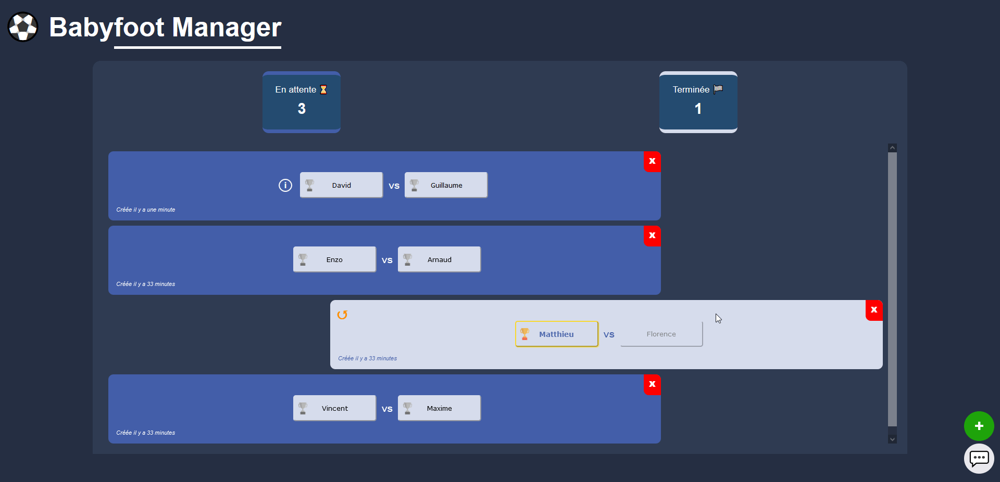
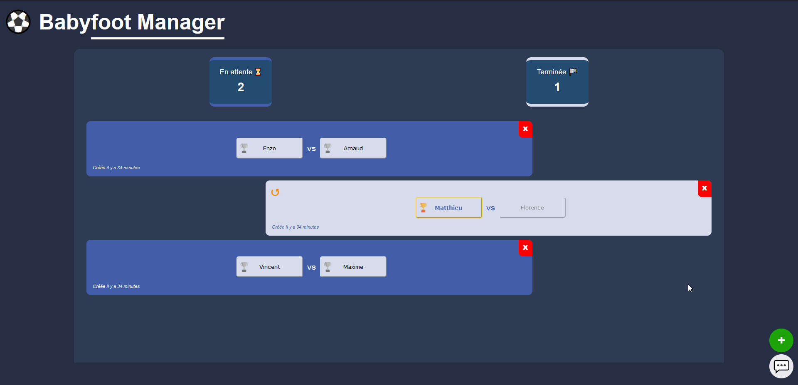
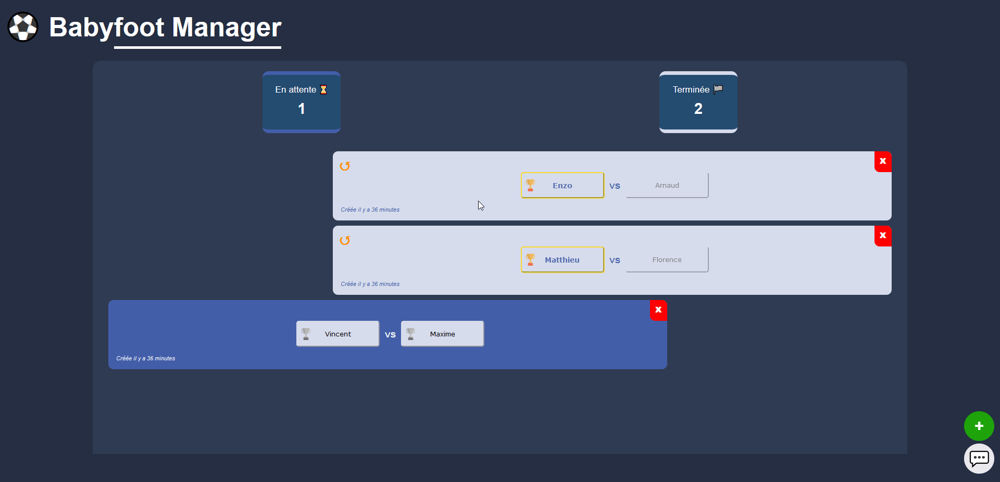
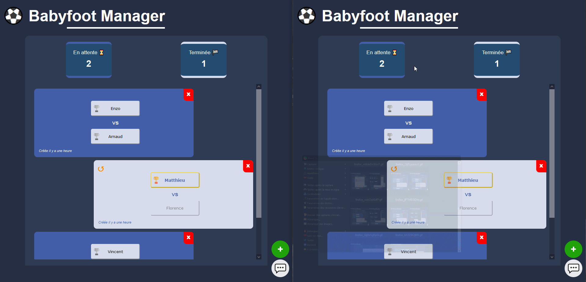
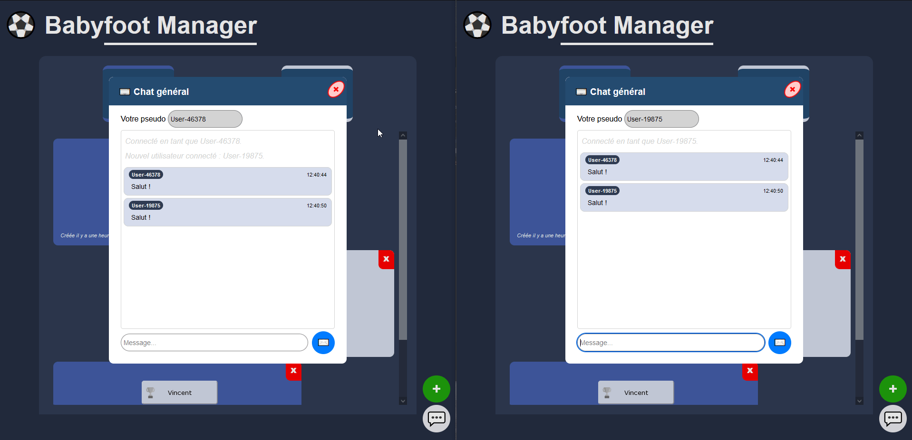

# Babyfoot Manager

  Babyfoot Manager est une application de type *Todo List Like* permettant de gérer le statut d'une liste de matchs et d'en indiquer leur issue. Un chat textuel est également disponible pour permettre aux utilisateurs de communiquer.
  
  Voir [Consignes et contraintes](docs/Test_BabyFoot_Manager.pdf).
## Requirements

[Docker Compose](https://docs.docker.com/compose/install/)
## Installation

```bash
git clone https://github.com/MaximilienRlt/babyfoot-manager-easilys
cd babyfoot-manager-easilys
docker-compose up
```

## Architecture
L'application s'organise autour d'un **serveur Express** exposant une page statique permettant à l'utilisateur d'interagir en temps réel avec une liste de matchs. Un chat textuel, réalisé à l'aide de Websockets, est également disponible pour communiquer avec d'autres utilisateurs en ligne.

### API REST
L'API REST exposée permet au client d'appliquer les actions de l'utilisateur aux données stockées et ainsi sauvegarder les modifications réalisées.

| Méthode | URL     | Description                              |
| :-------- | :------- | :--------------------------------        |
| `GET`      | `/api/games` | Récupérer la liste de matchs |
| `POST`      | `/api/games` | Créer un match |
| `DELETE`      | `/api/games/${id}` | Supprimer un match |
| `PATCH`      | `/api/games/${id}` | Editer partiellement un match |

La vérification des paramètres et du corps des requêtes est réalisée avec la librairie [express-validator](https://express-validator.github.io).

### Websocket
Mise en place des Websockets en utilisant [socket.io](https://socket.io/). Les fonctionnalités proposées étant :
* La propagation des modifications réalisées via l'API en temps réel.  

  Événements émis/captés
  | Événement    | Description                              |
  | :--------  |:--------------------------------        |
  | `deleted`   | Suppression d'une partie |
  | `created`   |  Création d'une partie |
  | `updated`    |   Mise à jour d'une partie|


* Un chat instantané connectant les utilisateurs de l'application.

  Événements émis/captés
  | Événements | Description                              |
  | :--------  |:--------------------------------        |
  | `client-login` |  Connexion au chat en renseignant un nom d'utilisateur |
  | `server-msg` |  Message d'information émis par le serveur (ex: déconnexion client) |
  | `chat-msg`  |  Message client diffusé globalement par le serveur après réception|

### Données
Les données sont stockées sous une base de données PostgreSQL dont le schéma est le suivant :
* Table `Players`
| Attribut | Type     | Description                              |
| :-------- | :------- | :--------------------------------        |
| `id_player` (PK)     | `INT` | Identifier du joueur |
| `name` NOT NULL      | `VARCHAR` | Nom du joueur |

* Table `Games`
| Attribut | Type     | Description                              |
| :-------- | :------- | :--------------------------------        |
| `id` (PK)     | `INT` | Identifiant de la partie |
| `description`      | `VARCHAR` | Informations supplémentaires |
| `player1` (FK Players) NOT NULL | `INT` | Identifiant joueur 1 |
| `player2` (FK Players) NOT NULL | `INT` | Identifiant joueur 2 |
| `id_winner` (FK Players)     | `INT` | Identifiant du joueur gagnant |
| `id_winner`     | `INT` | Identifiant du joueur gagnant |

### Client
L'interface de l'application est une page statique réalisée en utilisant HTML/CSS/VanillaJS.
Une architecture MVC basique permet à l'application d'être réactive et réagir aux changements transmis par la Websocket mais aussi par l'utilisateur.

## Demo
### Gestion des matchs
* Ajout d'un match


* Suppression d'un match


* Renseignement du résultat d'un match


* Réinitialisation des données d'un match


### Chat instantané
* Accès et utilisation du chat textuel


* Modification du nom d'utilisateur


## Améliorations

### Gestion des matchs
* Détailler les informations du match (heure, date, équipe, ...)
* Ajout de fonctionnalités de manipulation de la liste (tri, filtrage ...)
* ...

### Chat instantané
* Gestion complète d'une session utilisateur
* Stockage du pseudo de tchat dans le navigateur et récupération à la connexion (localStorage, cookies ...)
* ...